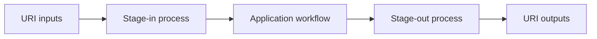

# How Wrapping Works

EO Application Package workflows often operate on staged `Directory` or `File` values, while external callers commonly provide and receive URI-like references. `eoap-cwlwrap` bridges those two interfaces by creating an orchestrator workflow around the application workflow.

The generated orchestrator has three responsibilities:

- stage external URI inputs into local CWL `Directory` or `File` objects
- run the application workflow with its original typed inputs
- stage selected `Directory` or `File` outputs back out to URI-compatible values

The application workflow remains the unit that performs the scientific or processing work. The generated `main` workflow is orchestration glue: it adapts the public interface, wires data movement, adds CWL requirements such as scatter or inline JavaScript when nullable or array values require them, and packs the participating processes into a graph.

This separation keeps stage-in and stage-out behavior reusable across workflows, while allowing each wrapped workflow to expose a URI-oriented interface suitable for execution platforms and distribution.
