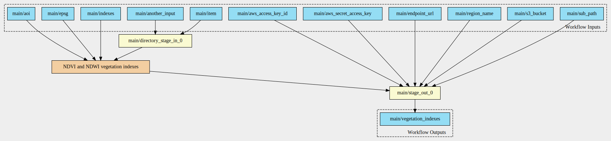
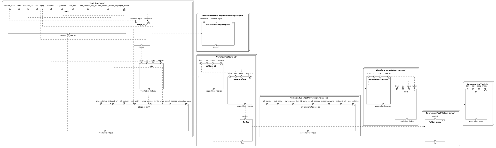
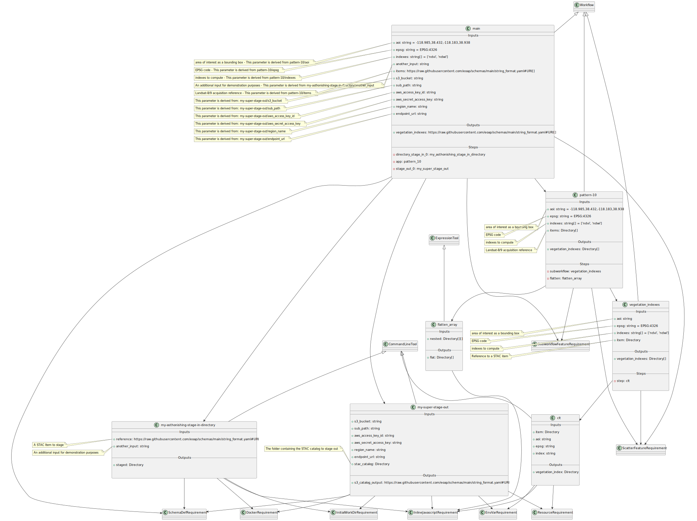

# Pattern 10 - multiple inputs, multiple outputs

The CWL includes:
- input parameter of type `Directory[]`;
- output parameter of type `Directory[]`.

This scenario takes as input an array of acquisition, applies an algorithm to each of them.

This scenario shows the need to flatten the output of the subworkflow, which is an array of arrays, into a single array of directories.

## Workflow Diagram

## Components Diagram

## Class Diagram

