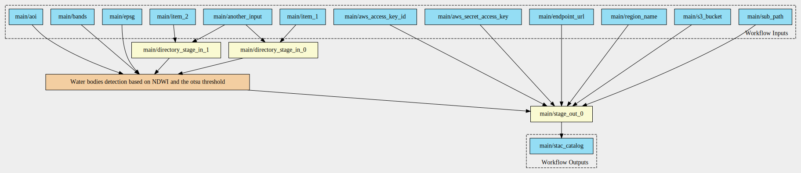
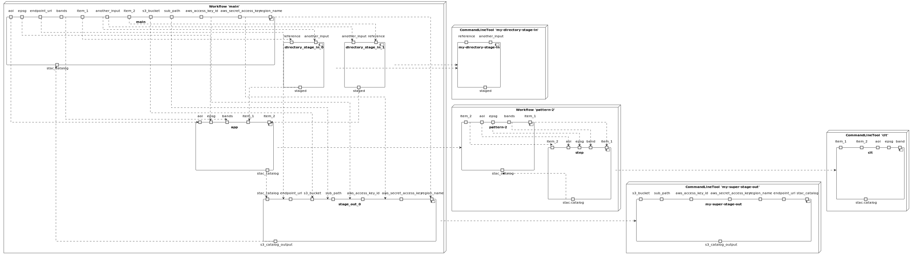
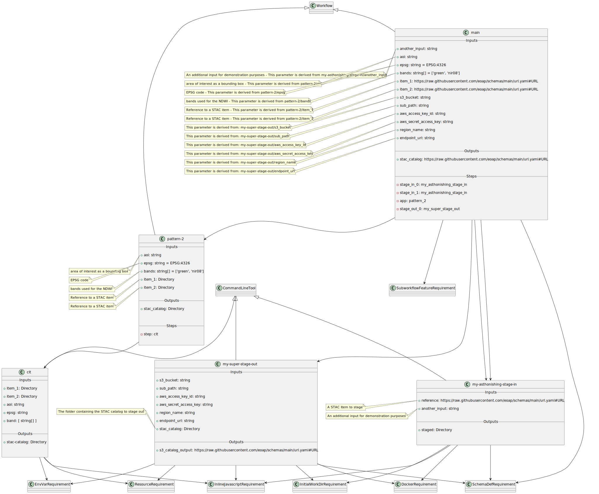

# Pattern 2 - double input, single output

The CWL includes:

- two different input parameters of type `Directory`;
- output parameter of type `Directory`.

## Workflow Diagram

## Components Diagram

## Class Diagram

