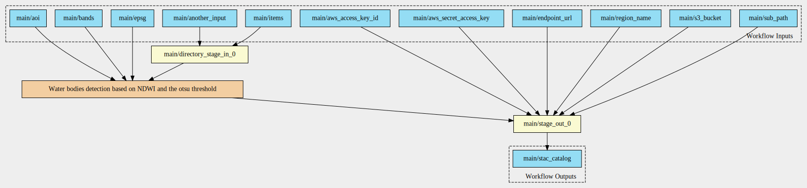
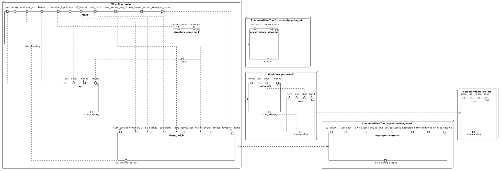
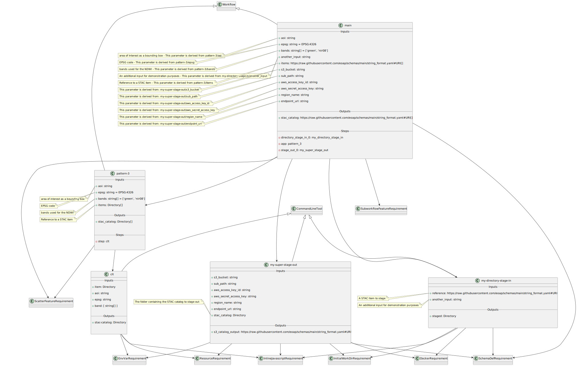

# Pattern 3 - single multiple inputs, single multiple outputs

The CWL includes:

- input parameter of type `Directory[]`;
- output parameter of type `Directory[]`.

## Workflow Diagram

## Components Diagram

## Class Diagram

