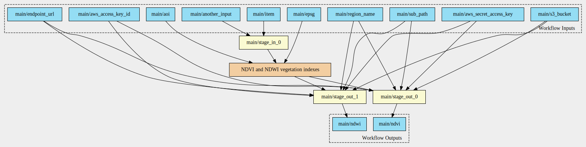
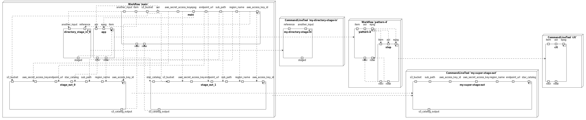
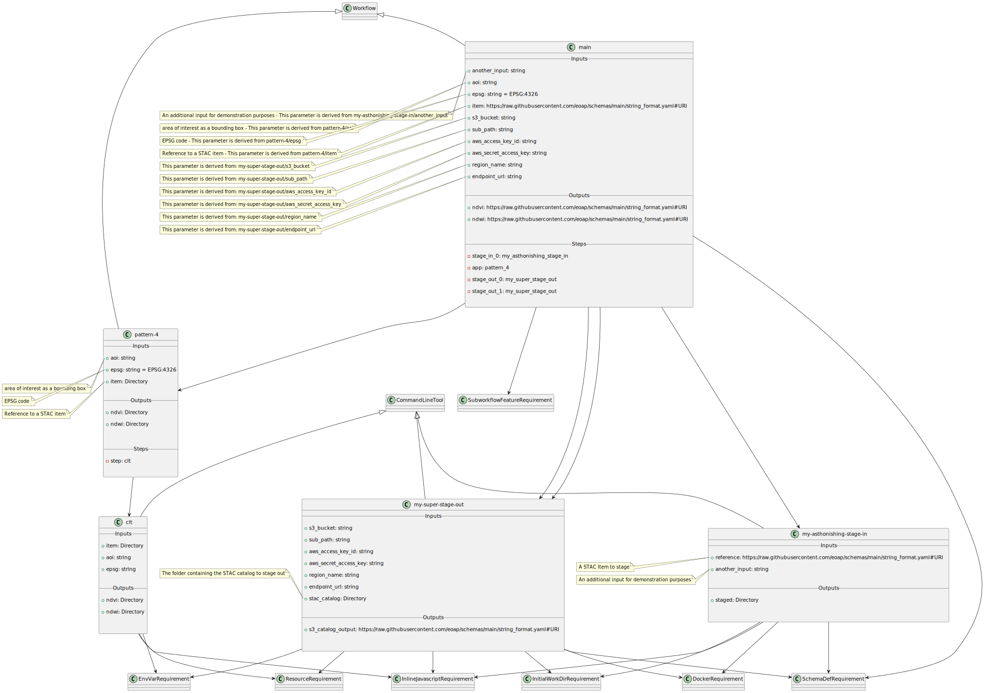

# Pattern 4 - single input, double output

The CWL includes:

- input parameter of type `Directory`;
- two different output parameters of type `Directory`.

## Workflow Diagram

## Components Diagram

## Class Diagram

