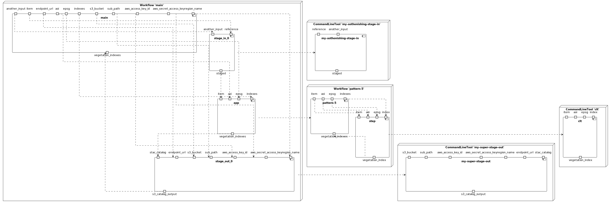
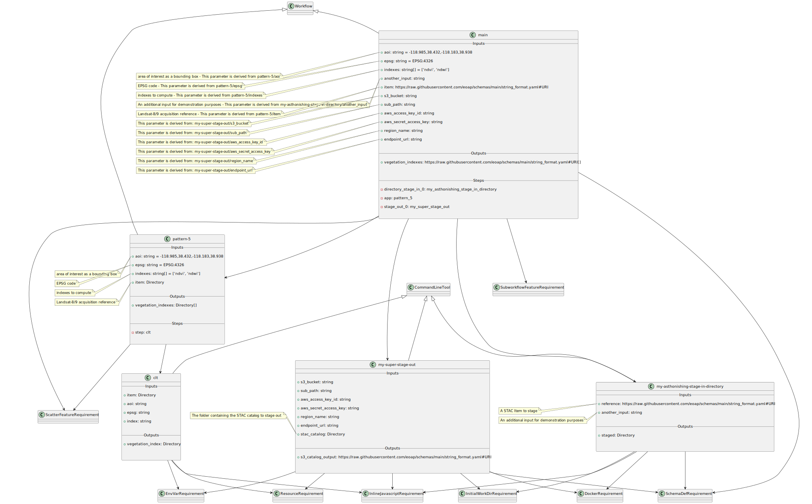

# Pattern 5 - single input, multiple outputs

The CWL includes:

- input parameter of type `Directory`;
- output parameter of type `Directory[]`.

## CWL

[Download Workflow](./workflows/pattern-5.cwl)

## Workflow Diagram

## Components Diagram

## Class Diagram

