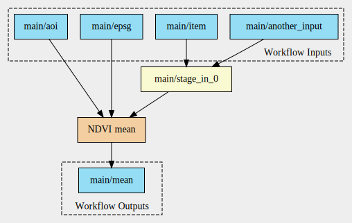
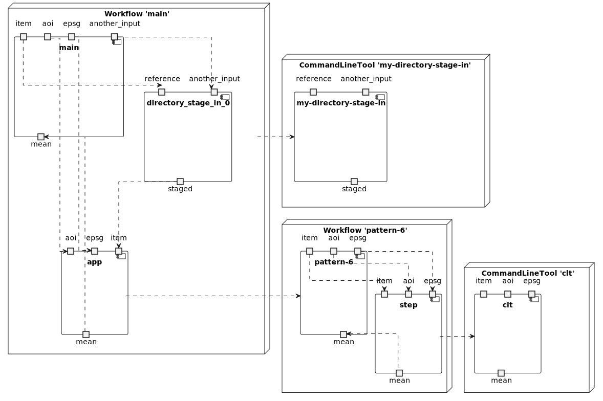
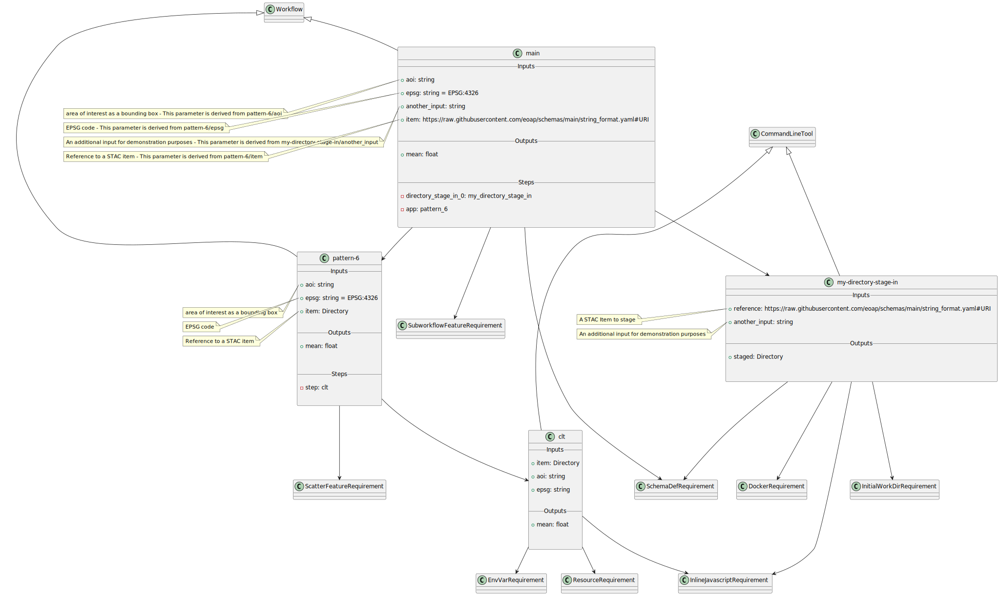

# Pattern 6 - one input, no output

The CWL includes: 

- one input parameter of type `Directory`;
- there are _no_ output parameters of type `Directory`.

This corner-case scenario takes as input an acquisition, applies an algorithm and generates an output that is not a STAC Catalog.

Implementation: derive the NDVI mean taking as input a Landsat-9 acquisition.

## Workflow Diagram

## Components Diagram

## Class Diagram

