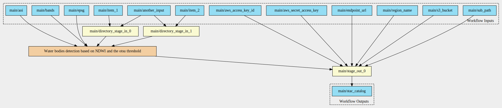
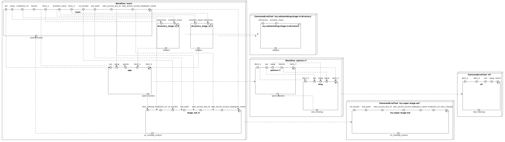
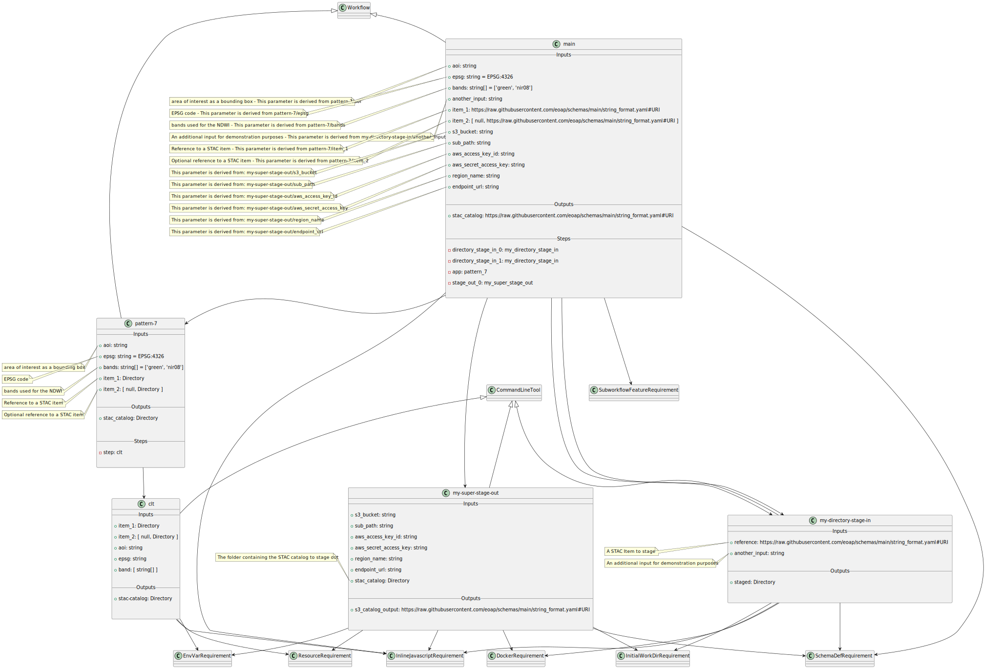

# Pattern 7 - double (optional) inputs, single output

The CWL includes:

- input parameter of type `Directory`;
- input parameter of type `Directory?`;
- output parameter of type `Directory`.

## Workflow Diagram

## Components Diagram

## Class Diagram

