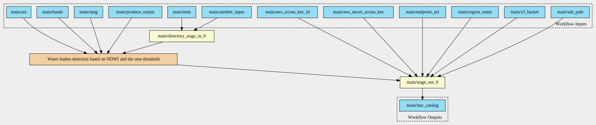
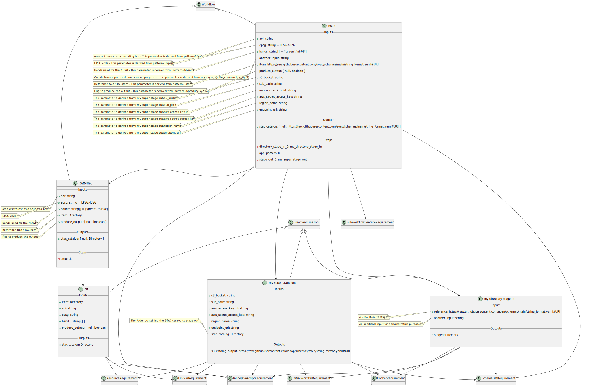

# Pattern 8 - one input, optional output

The CWL includes: 

- one input parameter of type `Directory`;
- one output parameter of type `Directory?`.

This scenario takes as input an acquisition, applies an algorithm and may or may not generate and output.

Implementation: process the NDVI taking as input a Landsat-9 acquisition with a parameter to create or not the output.

## CWL

[Download Workflow](./workflows/pattern-8.cwl)

## Workflow Diagram

## Components Diagram

## Class Diagram

